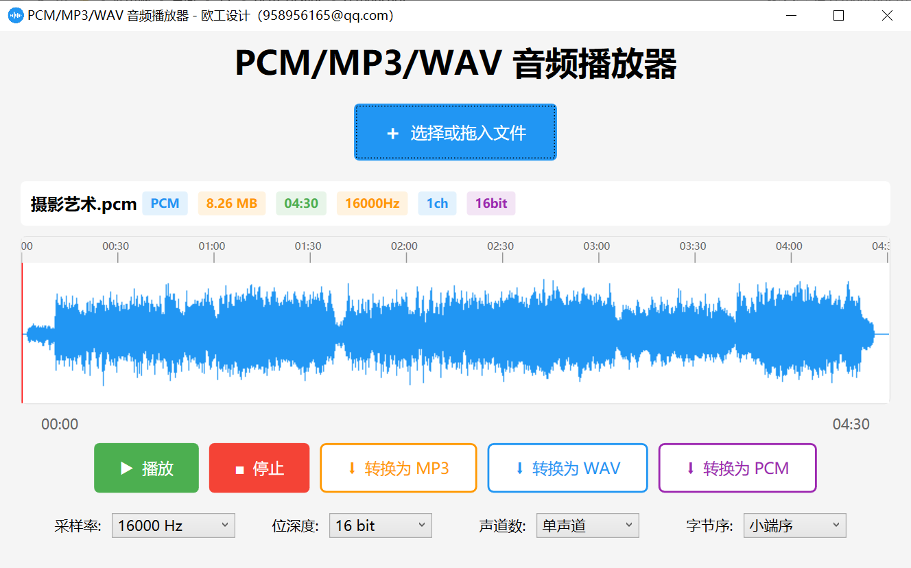

# PCM Player

一个便捷易用的 PCM 音频文件播放器，支持 PCM、WAV 和 MP3 格式的播放与转换。

## 主要特性

### 🎵 音频播放

- **多格式支持**：PCM 裸数据、WAV、MP3
- **实时波形显示**：可视化音频波形，直观呈现音频内容
- **流畅播放控制**：播放/暂停/停止，支持进度跳转
- **智能指针跟随**：播放时波形自动滚动，指针智能定位

### ⚙️ PCM 参数配置

- **采样率**：8000Hz ~ 96000Hz（支持常用采样率）
- **位深度**：8/16/24/32 bit
- **声道数**：单声道/立体声
- **字节序**：小端序/大端序

### 🔄 格式转换

- **PCM → WAV**：将 PCM 裸数据转换为标准 WAV 格式
- **多格式 → MP3**：支持 PCM/WAV/MP3 转换为 MP3（128kbps）
- **灵活参数**：转换前可自定义音频参数

### 🖱️ 交互体验

- **拖放加载**：支持拖放文件快速加载
- **波形缩放**：滚轮缩放（10-10000 像素/秒）
- **波形拖拽**：鼠标拖拽浏览完整波形
- **单击定位**：点击波形任意位置跳转播放

## 系统要求

- Windows 7 或更高版本
- .NET Framework 4.8

## 使用说明

### 1. 加载文件

- 点击"选择文件"按钮选择音频文件
- 或直接拖放文件到窗口

### 2. PCM 文件参数设置

- PCM 文件需要手动设置参数（采样率、位深度、声道数、字节序）
- WAV 和 MP3 文件自动识别参数，无需手动配置

### 3. 播放控制

- **播放/暂停**：点击播放按钮
- **停止**：点击停止按钮
- **跳转**：点击波形任意位置快速跳转

### 4. 波形操作

- **缩放**：鼠标滚轮上下滚动
- **拖拽**：按住鼠标左键拖动波形
- **复位**：点击"复位视图"按钮恢复默认缩放

### 5. 格式转换

- 点击"转换为 WAV"或"转换为 MP3"按钮
- 对于 PCM 文件，会弹出参数设置对话框
- 选择保存位置，等待转换完成
